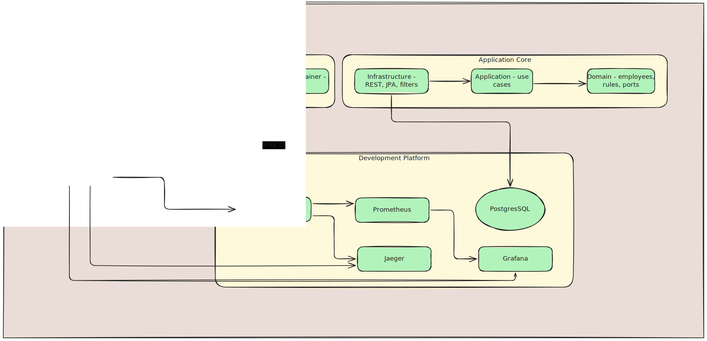

# Employees API


Internal engineering entrypoint for the Employees API repository.

## Architecture Snapshot



## Start Here

The primary documentation experience now lives in the Docsify portal.

```bash
cd docker/dev
docker compose up --build -d
```

Then open:

- Docs portal: http://localhost:3200
- API: http://localhost:8080/api
- Swagger UI: http://localhost:8080/api/swagger-ui.html
- OpenAPI: http://localhost:8080/api/v1/api-docs
- Grafana: http://localhost:3000
- Jaeger: http://localhost:16686

## Canonical Documentation

- Docsify home: [docs/README.md](docs/README.md)
- Architecture: [docs/architecture/overview.md](docs/architecture/overview.md)
- Docker workflow: [docs/operations/docker.md](docs/operations/docker.md)
- Production setup: [docs/operations/production-setup.md](docs/operations/production-setup.md)
- AI usage note: [docs/AI_USAGE.md](docs/AI_USAGE.md)
- k6 stress testing: [docs/testing/k6.md](docs/testing/k6.md)
- Docs portal maintenance: [docs/contributing/docs-portal.md](docs/contributing/docs-portal.md)

## Local Commands

### Development stack

```bash
cd docker/dev
docker compose up --build -d
```

### Docs portal only

```bash
cd docker/local
docker compose up -d docs
```

### Test suite

```bash
./gradlew test
```